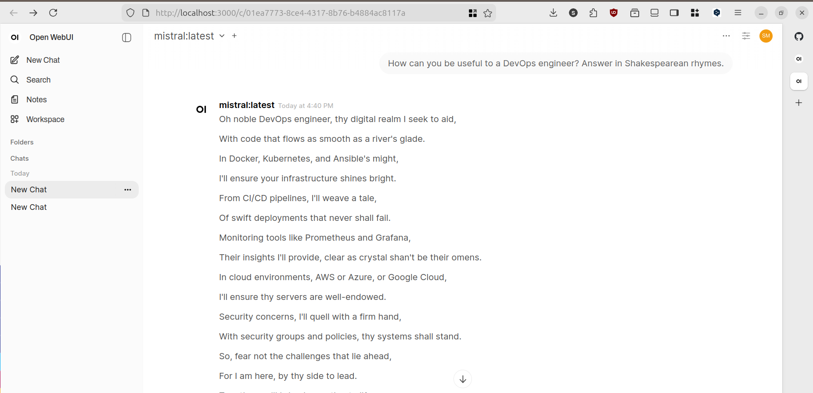
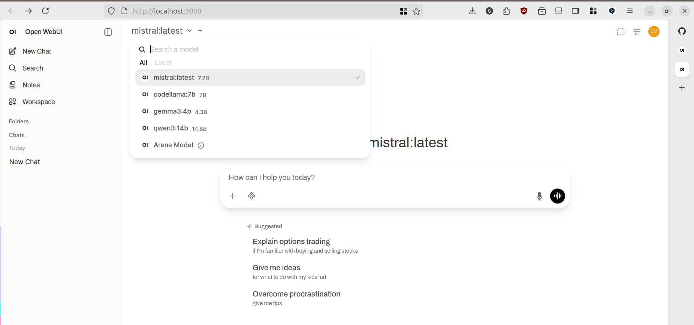
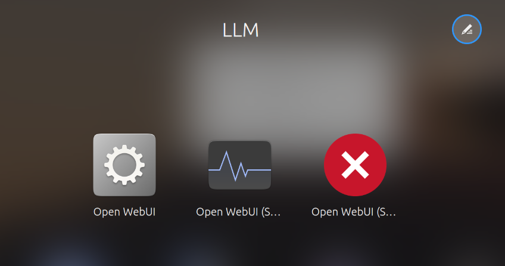

# Open WebUI + Ollama systemd Stack

<div align="center">


**Production-ready local AI with systemd service management, Docker bridge networking, and desktop integration.**

[Quick Start](docs/QUICK_START.md) • [Installation](docs/INSTALLATION.md) • [Architecture](docs/ARCHITECTURE.md) • [Troubleshooting](docs/TROUBLESHOOTING.md)

</div>

---

## 📸 Screenshots

<div align="center">

### Desktop Launcher Integration


### Open WebUI Interface


### systemd Service Status


</div>

---

## 🎯 Why This Project?

I wanted to run Open WebUI + Ollama on my laptop **without draining the battery**. Most guides just say "docker run" and leave you with containers running 24/7.

**Key features:**
- 🔋 **Battery optimized** - Manual control saves ~25% daily battery
- ⚙️ **systemd integration** - Proper service management, no hacks
- 🐳 **Docker bridge networking** - Clean isolation, production-ready
- 🖥️ **Desktop launchers** - One-click start/stop from application menu
- 📚 **Comprehensive docs** - Architecture decisions, troubleshooting guide
- 🔒 **GDPR compliant** - All data processed locally, no external APIs

**This is what I use daily on my HP EliteBook 845 G8.**

---

## ⚡ Quick Start

```bash
# Clone repository
git clone https://github.com/serg-markovich/openwebui-systemd-stack.git
cd openwebui-systemd-stack

# Configure Ollama (one-time setup)
sudo mkdir -p /etc/systemd/system/ollama.service.d/
echo -e '[Service]\nEnvironment="OLLAMA_HOST=0.0.0.0:11434"' | \
  sudo tee /etc/systemd/system/ollama.service.d/override.conf
sudo systemctl daemon-reload && sudo systemctl restart ollama

# Setup systemd service
mkdir -p ~/.config/systemd/user/
cp systemd/openwebui.service ~/.config/systemd/user/
systemctl --user daemon-reload

# Start service
systemctl --user start openwebui
```

**Open browser:** http://localhost:3000

### Desktop Launchers (Optional)

```bash
cp desktop/*.desktop ~/.local/share/applications/
```

**Full guide:** [Quick Start Documentation](docs/QUICK_START.md)

---

## 📖 Documentation

- **[Quick Start Guide](docs/QUICK_START.md)** - Get running in 5 minutes
- **[Installation Guide](docs/INSTALLATION.md)** - Detailed step-by-step setup
- **[Architecture](docs/ARCHITECTURE.md)** - Design decisions and trade-offs
- **[Troubleshooting](docs/TROUBLESHOOTING.md)** - Common issues and solutions
- **[Changelog](CHANGELOG.md)** - Version history

---

## 🛠️ Tech Stack

| Component | Technology | Purpose |
|-----------|------------|---------|
| **Container Runtime** | Docker 24.0+ | Isolation, reproducibility |
| **Service Manager** | systemd 249+ | Lifecycle management |
| **Orchestration** | docker-compose v2 | Service definition |
| **Web UI** | Open WebUI | Chat interface |
| **LLM Runtime** | Ollama | Model serving |
| **Desktop Integration** | XDG Desktop Entry | GUI launchers |

---

## 💻 My Setup

**Hardware:** HP EliteBook 845 G8  
**OS:** Ubuntu 24.04 LTS  
**Use case:** Daily driver for development + local AI experiments

### Models I Use

| Model | Size | Purpose |
|-------|------|---------|
| `mistral` | ~4.1 GB | Universal - general tasks + coding |
| `qwen3:14b` | ~9 GB | Heavy lifting - complex reasoning |
| `gemma3:3b` | ~2 GB | Quick responses - simple questions |
| `codellama:7b` | ~3.8 GB | Code-specific (refactoring, debugging) |

**Model selection strategy:**
- Start with `gemma3:3b` for quick questions (saves battery)
- Switch to `mistral` for coding + general work
- Use `qwen3:14b` when quality matters most
- `codellama:7b` for dedicated code review

---

## 🎓 What I Learned

**Debugging journey:**
- Spent 2 hours figuring out `172.17.0.1` gateway IP for Docker bridge networking
- Learned `OLLAMA_HOST=0.0.0.0` is critical (default `127.0.0.1` doesn't work from containers)
- Discovered `Type=oneshot` + `RemainAfterExit=yes` pattern for docker compose services
- Measured 25% daily battery savings with manual control vs auto-restart

**Key decisions:**
- Bridge networking over host mode (better isolation)
- User service over system service (no sudo required)
- Manual control over auto-start (battery optimization)
- Named volume over bind mount (easier backup)

Full details → [Architecture Documentation](docs/ARCHITECTURE.md)

---

## 🗺️ Roadmap

### Planned
- [ ] Prometheus monitoring for container metrics
- [ ] GitHub Actions CI/CD pipeline
- [ ] Ansible playbook for automated deployment
- [ ] Multi-distribution support (Fedora, Arch)

### Completed
- [x] systemd user service integration
- [x] Docker bridge networking setup
- [x] Desktop launchers (XDG standards)
- [x] Comprehensive documentation
- [x] Battery-optimized manual control

---

## 🤝 Contributing

Issues and PRs welcome! This is a learning project - feedback appreciated.

**Ways to contribute:**
- ⭐ Star the repo
- 🐛 Report bugs you encounter
- 📝 Improve documentation
- 💡 Suggest features

---

## 📜 License

MIT License - see [LICENSE](LICENSE)

---

## 🔗 Links

- **Open WebUI:** https://github.com/open-webui/open-webui
- **Ollama:** https://ollama.com
- **systemd:** https://systemd.io

---

**Built with** 🐳 Docker • ⚙️ systemd • 🐧 Linux • 🤖 Ollama

**Building in public, learning in public** 🚀
