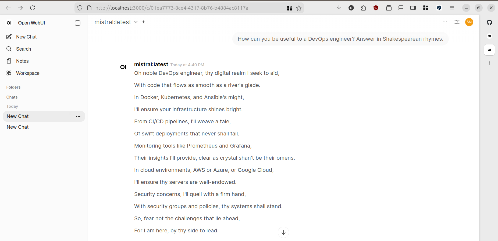
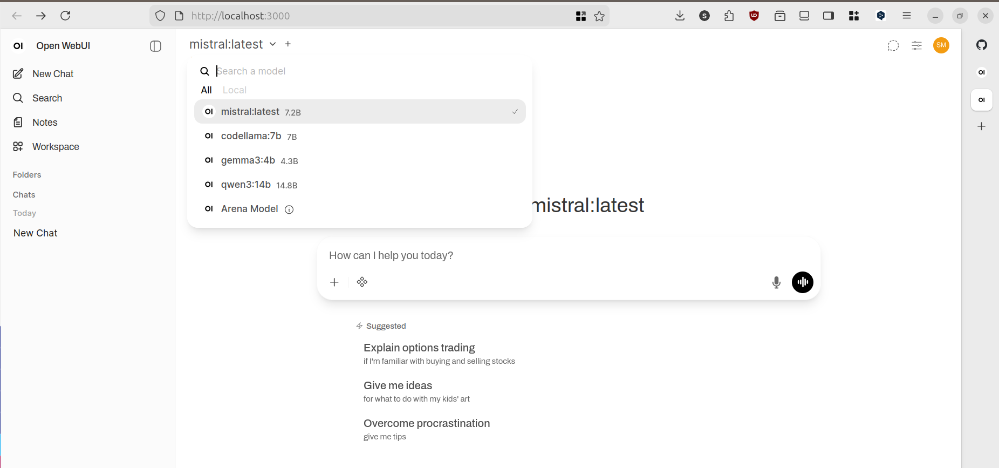
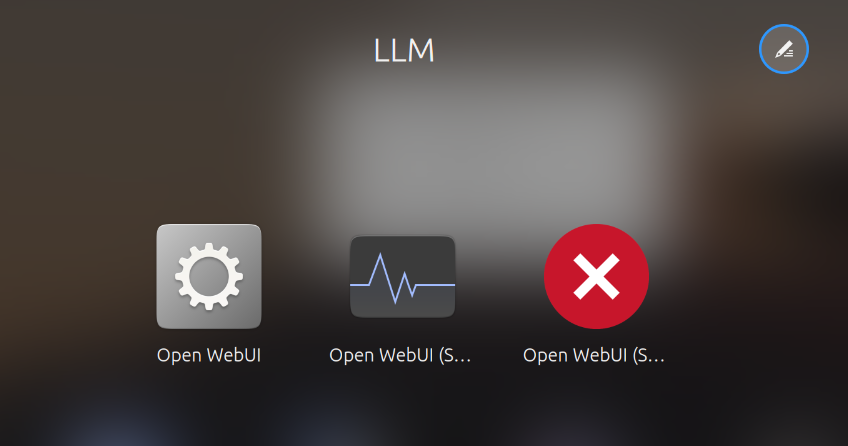

# Open WebUI + Ollama systemd Stack


Production-ready local AI stack with systemd service management, Docker bridge networking, and desktop integration.

[Quick Start](docs/QUICK_START.md) • [Installation](docs/INSTALLATION.md) • [Architecture](docs/ARCHITECTURE.md) • [Troubleshooting](docs/TROUBLESHOOTING.md)

---

## Screenshots

<div align="center">



</div>

---

## Why This Project?

Most guides say "docker run" and leave you with containers running 24/7. I wanted to run Open WebUI + Ollama on a laptop **without draining the battery** — with proper service management, not a hack.

**Key features:**
- **Battery optimized** — manual control saves ~25% daily battery
- **systemd integration** — proper lifecycle management, no background bloat
- **Docker bridge networking** — clean isolation, production-ready
- **Desktop launchers** — one-click start/stop from application menu
- **GDPR compliant** — all data processed locally, no external APIs

---

## Quick Start

```bash
cd ~
git clone https://github.com/serg-markovich/openwebui-systemd-stack.git
cd openwebui-systemd-stack

# Configure Ollama (one-time setup)
sudo mkdir -p /etc/systemd/system/ollama.service.d/
echo -e '[Service]\nEnvironment="OLLAMA_HOST=0.0.0.0:11434"' | \
  sudo tee /etc/systemd/system/ollama.service.d/override.conf
sudo systemctl daemon-reload && sudo systemctl restart ollama

# Setup systemd service
mkdir -p ~/.config/systemd/user/
cp systemd/openwebui.service ~/.config/systemd/user/
systemctl --user daemon-reload

# Start
systemctl --user start openwebui
```

### Desktop Launchers (Optional)

```bash
chmod +x scripts/*.sh
cp desktop/*.desktop ~/.local/share/applications/
update-desktop-database ~/.local/share/applications/
```

Full guide: [Quick Start Documentation](docs/QUICK_START.md)

---

## Documentation

- [Quick Start Guide](docs/QUICK_START.md) — get running in 5 minutes
- [Installation Guide](docs/INSTALLATION.md) — detailed step-by-step setup
- [Architecture](docs/ARCHITECTURE.md) — design decisions and trade-offs
- [Troubleshooting](docs/TROUBLESHOOTING.md) — common issues and solutions
- [Changelog](CHANGELOG.md) — version history

---

## Tech Stack

| Component | Technology | Purpose |
|-----------|------------|---------|
| Container Runtime | Docker 24.0+ | Isolation, reproducibility |
| Service Manager | systemd 249+ | Lifecycle management |
| Orchestration | docker-compose v2 | Service definition |
| Web UI | Open WebUI | Chat interface |
| LLM Runtime | Ollama | Model serving |
| Desktop Integration | XDG Desktop Entry | GUI launchers |

---

## My Setup

**Hardware:** HP EliteBook 845 G8, Ubuntu 24.04 LTS

| Model | Size | Purpose |
|-------|------|---------|
| `mistral` | ~4.1 GB | General tasks, coding |
| `qwen3:14b` | ~9 GB | Complex reasoning |
| `gemma3:3b` | ~2 GB | Quick responses, saves battery |
| `codellama:7b` | ~3.8 GB | Code review, refactoring |

---

## What I Learned

- `172.17.0.1` is the Docker bridge gateway — not obvious until you spend 2 hours debugging
- `OLLAMA_HOST=0.0.0.0` is required — default `127.0.0.1` doesn't work from inside containers
- `Type=oneshot` + `RemainAfterExit=yes` is the correct systemd pattern for docker compose services
- Manual service control vs auto-restart: measured ~25% daily battery savings

Key decisions and reasoning: [Architecture Documentation](docs/ARCHITECTURE.md)

---

## Roadmap

### Planned
- [ ] Prometheus monitoring for container metrics
- [ ] Ansible playbook for automated deployment
- [ ] Multi-distribution support (Fedora, Arch)

### Completed
- [x] systemd user service integration
- [x] Docker bridge networking setup
- [x] Desktop launchers (XDG standards)
- [x] Battery-optimized manual control
- [x] Makefile — unified entry point
- [x] GitHub Actions CI/CD pipeline
- [x] Backup/restore for chat history
- [x] Comprehensive documentation

---

## Contributing

Issues and PRs welcome.

- Star the repo if it's useful
- Report bugs you encounter
- Improve documentation
- Suggest features

---

## Eigenstack

This project is built around the [eigenstack](https://github.com/serg-markovich/eigenstack)
philosophy — privacy-first, local-first infrastructure where every service
runs on your own hardware, no cloud dependencies, no vendor lock-in.

**Related projects:**
- [eigenstack](https://github.com/serg-markovich/eigenstack) — architecture overview
- [local-whisper-obsidian](https://github.com/serg-markovich/local-whisper-obsidian) — local voice transcription pipeline
- [whisper-ollama-enricher](https://github.com/serg-markovich/whisper-ollama-enricher) — AI enrichment for voice notes

---

## License

MIT — see [LICENSE](LICENSE)
